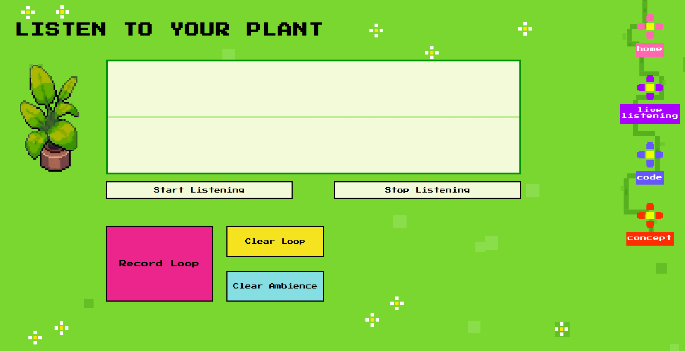

# 𖡼.𖤣⸙.𖤣⸙ Live Planting - Plant Biodata Sonification 𖡼.𖤣⸙.𖤣⸙


https://github.com/user-attachments/assets/f5ad0383-f374-4959-abae-494a96315261


An interactive web-based system that transforms plant bioelectrical signals and soil humidity into real-time musical compositions. Experience your plant's "voice" through a retro-styled interface with 8-bit aesthetics.

## ♬⋆.˚ Overview ⋆.˚♬

This project implements **Biodata Sonification** - converting measurable plant signals into audible sounds. By monitoring humidity levels and bioelectrical impulses, the system generates ambient soundscapes and rhythmic patterns that reflect your plant's real-time condition.

### Key Features

- **Real-time audio synthesis** from plant sensor data
- **Dual signal mapping**: humidity → ambient notes, bioelectrical impulses → pulse notes
- **Interactive loop recording** with up to 10 simultaneous layers
- **Live waveform visualization** using HTML5 Canvas
- **Retro pixel-art interface** with animated elements
- **Schroeder reverb** for spatial audio depth
- **Major scale quantization** for musical harmony

---

## ⚙︎ Technical Architecture ⚙︎

### Hardware Components

- **Arduino MEGA 2560** - Microcontroller for sensor data processing
- **APKLVSR Soil Moisture Sensor** - Measures soil humidity (range: 0-1023)
- **Symbiotic Kit** (Spad Electronics) - Converts plant bioelectrical signals to numerical data
- **TENS Electrodes** - Attached to plant leaves for signal detection

### Software Stack

**Backend (Python 3.x)**
- `sounddevice` - Real-time audio output (48kHz, 2048 buffer)
- `numpy` - DSP and synthesis calculations
- `pyserial` - Arduino communication (9600 baud)
- `aiohttp` - HTTP server for web commands
- `websockets` - Real-time visualization data streaming

**Frontend (Web)**
- HTML5 Canvas for waveform rendering
- JavaScript ES6+ with async/await
- CSS3 with animations
- Dual-protocol communication (HTTP + WebSocket)

---

## ⤓ Installation ⤓

### Prerequisites

```bash
# Python 3.8 or higher
python --version

# Arduino IDE (for uploading sketch)
# Download from: https://www.arduino.cc/en/software
```

### Setup

1. **Clone the repository**
```bash
git clone https://github.com/meg13/ACTAM25-LivePlanting.git
cd LivePlanting
```

2. **Install Python dependencies**
```bash
pip install numpy sounddevice pyserial aiohttp websockets
```

3. **Arduino Setup**
   - Upload the Arduino sketch (`sketch_dec3a_fix.ino`) to your MEGA board
   - Connect sensors:
     - APKLVSR humidity sensor → Analog pin **A1**
     - Symbiotic Kit output → Analog pin **A2**
   - Note your COM port (e.g., `COM5` on Windows, `/dev/ttyUSB0` on Linux)

4. **Configure COM Port**

Edit `audio_controller_http.py`:
```python
PORTA = "COM5"  # Change to your Arduino port
BAUD = 9600
```

---

## 🖳 Usage 🖳 

### Starting the System

1. **Launch Python backend**
```bash
python audio_controller_http.py
```

You should see:
```
✅ Audio engine (sounddevice)
✅ HTTP server on http://localhost:8080
✅ WebSocket server on ws://localhost:8765
🟢 READY! Open live_listening.html
```

2. **Open Web Interface**



Navigate to `html/live_listening.html` in your browser or use a local server:
```bash
# Optional: Use Python's built-in server
python -m http.server 8000
# Then open http://localhost:8000/html/live_listening.html
```

3. **Start Listening**
   - Click **"Start Listening"** button
   - Audio will play through your computer speakers
   - Waveform visualization appears in real-time

### Controls

| Button | Function |
|--------|----------|
| **Start Listening** | Begins audio synthesis from sensor data |
| **Stop Listening** | Pauses audio generation |
| **Record Loop** | Captures current pulse notes into a loop |
| **Clear Loop** | Removes all recorded loops |
| **Clear Ambience** | Resets all ambient notes |

---

## °‧𖧧⋆ೃ࿔*:･ How It Works °‧𖧧⋆ೃ࿔*:･

### Signal Mapping

**Bioelectrical Impulses (0-1023 ADC) → Pulse Notes**
- Maps to 5-octave range (60 semitones) starting from C1 (base MIDI 24)
- Quantized to **major scale** (C, D, E, F, G, A, B)
- Generates short notes (300ms) with Hann envelope
- Minimum 12-semitone threshold to filter noise
- 200ms cooldown between pulse triggers

**Soil Humidity (200-400 range) → Ambient Notes**
- Maps to 3-octave major scale starting from C2 (base MIDI 36)
- Values averaged over 20-second windows
- Creates sustained notes with:
  - Vibrato: 4.8-5.6 Hz, depth 8-14 cents
  - Tremolo: 0.1-0.3 Hz, depth 6-14%
  - 1.5s attack time for smooth fade-in
- Maximum 24 simultaneous ambient voices

### Audio Synthesis

**Additive Synthesis**: Each note combines 3 harmonics (fundamental + 2 overtones)

**Schroeder Reverb**: 
- 4 parallel comb filters (29.7, 37.1, 41.1, 43.7 ms delays)
- 2 series allpass filters (5.0, 1.7 ms delays)
- Wet: 42%, Dry: 82%, Feedback: 0.78

**Sample Rate**: 48000 Hz  
**Buffer Size**: 2048 samples (high latency mode for stability)

### Communication Protocol

```
┌───────────────────────┐              ┌───────────────────────┐
│        BROWSER        │              │    PYTHON BACKEND     │
│                       │              │                       │
│  ┌─────────────────┐  │  HTTP POST   │  ┌─────────────────┐  │
│  │    COMMANDS     │──┼─────────────>│  │  API ENDPOINTS  │  │
│  │ /start, /stop   │  │              │  │ /start, /stop   │  │
│  └─────────────────┘  │              │  └─────────────────┘  │
│                       │              │                       │
│  ┌─────────────────┐  │  WEBSOCKET   │  ┌─────────────────┐  │
│  │   CANVAS VIZ    │<─┼──────────────│  │   AUDIO DATA    │  │
│  │  Float32 @10Hz  │  │              │  │  Stream Buffer  │  │
│  └─────────────────┘  │              │  └─────────────────┘  │
└──────────┬────────────┘              └──────────┬────────────┘
           ^                                      │
           │           ┌────────────────┐         │
           └───────────┤  SOUNDDEVICE   │<────────┘
                       └───────┬────────┘
                               │
                               ▼
                            SPEAKERS
```

---

## 🗀 Project Structure 🗀

```
live-planting/
├── audio_controller_http.py       # Main Python backend
├── arduino/
│   └── sketch_dec3a_fix.ino       # Arduino sketch (upload to MEGA)
├── html/
│   ├── homepage.html              # Landing page with START button
│   ├── live_listening.html        # Main audio interface
│   ├── concept.html               # Project documentation
│   └── codes.html                 # Technical details
├── css/
│   ├── style.css                  # Global styles & navigation
│   ├── live_listening_style.css   # Audio interface styles
│   ├── homepage.css               # Landing page styles
│   ├── concept_style.css          # Documentation styles
│   ├── codes_style.css            # Code page styles
│   └── prism.css                  # Code blocks styles
├── js/
│   ├── live_listening.js          # Audio controller (HTTP + WebSocket)
│   ├── nav.js                     # Animated navigation flowers
│   ├── cows.js                    # Walking cow animations
│   ├── ducks.js                   # Jumping duck animations
│   ├── flower.js                  # Decorative flower spawner
│   ├── grass.js                   # Grass background elements
│   ├── codes.js                   # Code page interactivity
│   └── prism.js                   # Code block highlighting library
└── images/
    ├── Plant.png                  # Pixel art plant
    ├── duck.svg                   # Duck sprite
    ├── duck_for_code_report.svg   # Duck sprite for code report
    ├── cow.svg                    # Cow sprite
    ├── branch.svg                 # Navigation decoration
    ├── bg_flower.svg              # Background flower
    ├── grass.svg                  # Grass decoration
    ├── pxlFlowe.svg               # Pixel flower for code report
    ├── pause.png                  # Pause button icon
    ├── homepage_screenshot.png    # Homepage screenshot
    └── livelistening_screenshot.png # Live listening screenshot
```
---

## 🕮 References 🕮

- [Symbiotic Kit Documentation](https://linktr.ee/spad_electronics)
- [sounddevice Python library](https://python-sounddevice.readthedocs.io/)
- [HTML5 Canvas API](https://developer.mozilla.org/en-US/docs/Web/API/Canvas_API)

---

## ✎ ⋆˚Authors˚₊ ✎

**Advanced Coding Tools and Methodologies Course Project**

- Margherita Raponi
- Vittoria Tomiati
- Sara Naima D'angelo
- Alessando Covini

---

**°❀⋆.ೃ࿔⸙*:･ Listen to your plant. Hear nature's hidden symphony °❀⋆.ೃ࿔⸙*:･**

⠀⠀⠀⠀⠀⠀⠀⠀⠀⠀⠀⠀⠀⠀⠀⠀⠀⠀⠀⠀⠀⠀⠀⠀⠀⠀⠀⠀⠀⠀⠀⠀⠀⠀⠀⠀⠀⠀⠀⠀⠀⠀⠀⠀⠀⠀⠀⠀⠀⠀⠀⠀⠀⠀⢀⣠⠤⠤⣄⠀⠀⠀⠀
⠀⠀⠀⠀⠀⠀⠀⠀⠀⠀⠀⠀⠀⠀⠀⠀⠀⠀⠀⠀⠀⠀⠀⠀⠀⠀⠀⠀⠀⠀⠀⠀⠀⠀⠀⠀⠀⠀⠀⠀⠀⠀⠀⠀⠀⠀⠀⠀⠀⠀⠀⠀⣠⠞⠉⢀⣀⣀⣿⣧⠀⠀⠀
⠀⠀⠀⠀⠀⠀⠀⠀⠀⠀⠀⠀⠀⠀⠀⠀⠀⠀⠀⠀⠀⠀⠀⠀⠀⠀⠀⠀⠀⠀⠀⠀⠀⠀⠀⠀⠀⠀⠀⠀⠀⡀⠀⠀⠀⠀⠀⠀⠀⠀⢰⣾⠁⣠⠖⠉⢀⣀⣧⣈⣧⠀⠀
⠀⠀⠀⠀⠀⠀⠀⠀⠀⠀⠀⠀⠀⠀⠀⠀⠀⠀⠀⠀⠀⠀⠀⠀⠀⠀⠀⠀⠀⠀⠀⠀⠀⠀⠀⠀⠀⢀⣀⣀⣀⣷⣄⠀⠀⠀⠀⠀⠀⣠⢾⠛⣿⡁⣠⠞⠉⢀⣯⣀⣈⣇⠀
⠀⠀⠀⠀⠀⢀⣼⣿⣆⠀⠀⠀⠀⠀⠀⠀⠀⠀⠀⠀⠀⠀⠀⠀⠀⠀⠀⠀⠀⠀⠀⠀⠀⠀⠀⡠⠞⠉⠀⣀⣘⣏⠛⣷⢤⣀⣀⡤⠞⠁⣸⠟⠀⡷⠃⣠⣶⣟⣏⣀⣀⣘⣆
⠀⠀⠀⠀⠀⣾⡿⠛⢻⡆⠀⠀⠀⠀⠀⠀⠀⠀⠀⠀⠀⠀⠀⠀⠀⠀⠀⠀⠀⠀⠀⠀⠀⢠⠞⠀⣠⠖⠉⠉⠉⣏⠙⡿⢾⣄⣀⣀⣠⣼⣽⣠⠞⠀⡰⠃⢨⠟⠋⠀⠀⠀⠉
⠀⠀⠀⠀⢰⣿⠀⠀⢸⡇⠀⠀⠀⠀⠀⠀⠀⠀⠀⠀⠀⠀⠀⠀⠀⠀⠀⠀⠀⠀⠀⠀⢀⡏⢠⠞⠁⣠⣴⣾⣿⠏⠉⠓⢾⣦⣀⡀⢻⡿⠟⠁⢀⠞⠁⡴⠃⠀⠀⠀⠀⠀⠀
⠀⠀⠀⠀⠸⡇⠀⢀⣾⠇⠀⠀⠀⠀⠀⠀⠀⠀⠀⠀⠀⠀⠀⠀⠀⠀⠀⠀⠀⢸⣆⠀⡸⢀⠏⢠⠞⠁⣨⠟⠋⠉⠉⠉⢻⡧⢤⣈⣁⣀⣠⠖⠋⢀⡞⠁⠀⠀⠀⠀⠀⠀⠀
⠀⠀⠀⠀⠀⣿⣤⣿⡟⠀⠀⠀⠀⠀⠀⠀⠀⠀⠀⠀⠀⠀⠀⠀⠀⠀⠀⠀⠀⢸⠛⢳⡇⡸⢠⠏⢠⠞⠁⣠⠔⠊⠉⠉⢻⠗⠦⣄⣀⠀⢀⣠⠔⠋⠀⠀⠀⠀⠀⠀⠀⠀⠀
⠀⠀⠀⠀⣠⣾⣿⣿⠀⠀⠀⠀⠀⠀⠀⠀⠀⠀⢀⢠⣀⣀⣤⠀⠀⠀⠀⠀⠀⢸⣀⡞⣷⠇⡜⢠⠏⢀⡞⠁⠀⠀⣰⢞⣻⠇⠀⠀⠀⠉⠁⠀⠀⠀⠀⠀⠀⠀⠀⠀⠀⠀⠀
⠀⠀⣠⣾⣿⡿⣏⠀⠀⠀⠀⠀⠀⠀⠀⠀⢠⡐⠦⠤⢤⡈⣻⢿⡖⠦⠤⣀⣠⣴⠏⢘⡟⢀⠃⡜⢠⠏⠀⠀⠀⠀⠛⠛⠋⠀⠀⠀⠀⠀⠀⠀⠀⠀⠀⠀⠀⠀⠀⠀⠀⠀⠀
⠀⣴⣿⡿⠋⠀⢻⡉⠀⠀⠀⠀⠀⠀⠀⠀⠑⠒⠢⠄⢤⣀⣏⠙⢻⠲⠤⢿⣿⣋⠤⠊⢀⣾⣠⠃⡜⠀⠀⠀⠀⠀⠀⠀⠀⠀⠀⠀⠀⠀⠀⠀⠀⠀⠀⠀⠀⠀⠀⠀⠀⠀⠀
⢰⣿⡟⠀⢀⣴⣿⣿⣿⣿⣦⠀⠀⠀⠀⠀⠒⠒⠲⠤⣤⡀⣯⣉⠛⠒⠦⠤⣀⣀⣀⡤⠚⢹⣿⣰⠃⠀⠀⠀⠀⠀⠀⠀⠀⠀⠀⠀⠀⠀⠀⠀⠀⠀⠀⠀⠀⠀⠀⠀⠀⠀⠀
⢸⡿⠀⠀⣿⠟⠛⣿⠟⠛⣿⣧⠀⠀⠀⠐⠐⠒⠒⠰⣹⠷⣯⣈⡉⠑⠒⠦⠤⣀⣀⣀⡤⢿⢀⣿⡄⠀⠀⠀⠀⠀⠀⠀⠀⠀⠀⠀⠀⠀⠀⠀⠀⠀⠀⠀⠀⠀⠀⠀⠀⠀⠀
⠘⣿⡀⠀⢿⡀⠀⢻⣤⠖⢻⡿⠀⠀⠀⠀⠀⠀⠀⠀⠀⠀⠀⠀⠉⠉⠓⠲⠤⢄⣀⣀⣀⣼⠟⣸⠃⠀⠀⠀⠀⠀⠀⠀⠀⠀⠀⠀⠀⠀⠀⠀⠀⠀⠀⠀⠀⠀⠀⠀⠀⠀⠀
⠀⠘⢷⣄⠈⠙⠦⠸⡇⢀⡾⠃⠀⠀⠀⠀⠀⠀⠀⠀⠀⠀⠀⠀⠀⠀⠀⠀⠀⠀⠀⣾⣿⡿⠀⠀⠀⠀⠀⠀⠀⠀⠀⠀⠀⠀⠀⠀⠀⠀⠀⠀⠀⠀⠀⠀⠀⠀⠀⠀⠀⠀⠀
⠀⠀⠀⠙⠛⠶⠤⠶⣿⠉⠀⠀⠀⠀⠀⠀⠀⠀⠀⠀⠀⠀⠀⠀⠀⠀⠀⠀⠀⠀⠀⠉⠁⠀⠀⠀⠀⠀⠀⠀⠀⠀⠀⠀⠀⠀⠀⠀⠀⠀⠀⠀⠀⠀⠀⠀⠀⠀⠀⠀⠀⠀⠀
⠀⠀⠀⠀⠀⠀⠀⠀⢹⡇⠀⠀⠀⠀⠀⠀⠀⠀⠀⠀⠀⠀⠀⠀⠀⠀⠀⠀⠀⠀⠀⠀⠀⠀⠀⠀⠀⠀⠀⠀⠀⠀⠀⠀⠀⠀⠀⠀⠀⠀⠀⠀⠀⠀⠀⠀⠀⠀⠀⠀⠀⠀⠀
⠀⠀⢀⣴⣾⣿⣆⠀⠈⣧⠀⠀⠀⠀⠀⠀⠀⠀⠀⠀⠀⠀⠀⠀⠀⠀⠀⠀⠀⠀⠀⠀⠀⠀⠀⠀⠀⠀⠀⠀⠀⠀⠀⠀⠀⠀⠀⠀⠀⠀⠀⠀⠀⠀⠀⠀⠀⠀⠀⠀⠀⠀⠀
⠀⠀⠈⣿⣿⡿⠃⠀⣰⡏⠀⠀⠀⠀⠀⠀⠀⠀⠀⠀⠀⠀⠀⠀⠀⠀⠀⠀⠀⠀⠀⠀⠀⠀⠀⠀⠀⠀⠀⠀⠀⠀⠀⠀⠀⠀⠀⠀⠀⠀⠀⠀⠀⠀⠀⠀⠀⠀⠀⠀⠀⠀⠀
⠀⠀⠀⠈⣙⠓⠒⠚⠉⠀⠀⠀⠀⠀⠀⠀⠀⠀⠀⠀⠀⠀⠀⠀⠀⠀⠀⠀⠀⠀⠀⠀⠀⠀⠀⠀⠀⠀⠀⠀⠀⠀⠀⠀⠀⠀⠀⠀⠀⠀⠀⠀⠀⠀⠀⠀⠀⠀⠀⠀⠀⠀⠀
